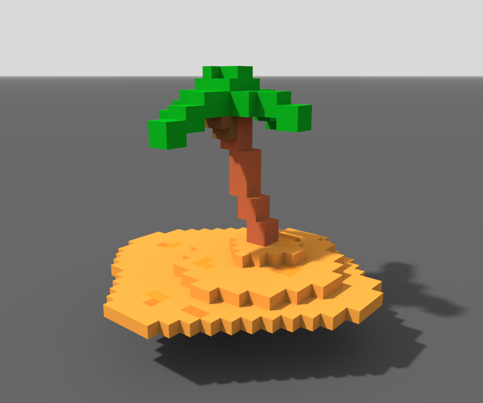

# Isola Sperduta - Report del Progetto
Autori:
- Florio Gioia Silvia [Matr n. 119328]
- Petreska Viktorija [Matr n. 123800]

## Descrizione del Progetto
Il  progetto consiste in una rappresentazione stilizzata (in quanto costituita da soli cubi in Three.js) di un'**isola in mezzo al mare su cui è intrappolato un naufrago** che si sbraccia per chiedere aiuto.

## Struttura del Progetto
Il progetto è ospitato su Github all'URL https://github.com/interactive3dgraphicscourse-uniud-2019/cubes-2019-petreska-florio. Il contenuto del repository è il seguente:

```
cubes-2019-petreska-florio
|
├── js/
|   |
|   ├── imports/   
|   |
|   ├── lib/   
|   |
|   └── main.js 
|
├── css/
|   |
|   └── main.js 
|   
├── images/
|
├── textures/
|
├── video/
|
├── journal.md
|
├── README.md
|
└── index.html
```

Il contenuto di file e cartelle è il seguente:
- `js/main.js` è il file con gli script `Start()` (setup della scena) e `Update()` (aggiornamento della scena per ogni animation frame)
- `js/lib` in questa cartella sono contenute le librerie esterne
- `js/imports` contiene le classi dove vengono definiti gli oggetti della scena
- `css/main.css`
- `images` screen capture e altre immagini utilizzate nel journal e nella documentazione in genere
- `textures` 
- `video` contiene due screen cast: uno non rielaborato, con registrazione 60FPS; uno rielaborato, con aggiunta di suoni
 - `journal.md` registro giornaliero dei progressi sul progetto
- `README.md` il presente file
- `index.html` è il file HTML con le referenze ai file JS e CSS che danno vita al progetto 


## Risultato finale

Il risultato raggiunto è il seguente:


Un video mostra il risultato ottenuto dall'animazione: https://github.com/interactive3dgraphicscourse-uniud-2019/cubes-2019-petreska-florio/blob/master/video/60FPS.mp4.

Vi è un altro video in cui sono stati aggiunti alcuni effetti sonori: https://github.com/interactive3dgraphicscourse-uniud-2019/cubes-2019-petreska-florio/blob/master/video/pre.avi.

Vi è infine il video di presentazione, con ulteriore post-processing e revisione degli elementi sonori: https://github.com/interactive3dgraphicscourse-uniud-2019/cubes-2019-petreska-florio/blob/master/video/final.mp4.


### Prestazioni
Il frame-rate della scena e relativa animazione, testato utilizzando un Dell G3 3579 con Intel i7-8750H, 16GB di RAM e Nvidia GTX1060 Max-Q, è di **60 fps** su Windows 10 Pro e Google Chrome Version 73.0.3683.86 (Official Build) (64-bit).

## Progettazione e sviluppo
Abbiamo come prima cosa ipotizzato uno scenario e gli elementi fondamentali che lo compongono. Ci siamo quindi fatte un'idea della forma che potrebbero avere tali elementi, giungendo a due prototipi:

### isola con la palma


### naufrago


Ci siamo a questo punto suddivise i compiti e iniziato lo sviluppo, concordando di utilizzare branch diversi così da sfruttare git nel lavoro in parallelo.

Dopodichè abbiamo unito i diversi elementi, operando opportune trasformazioni (rese facili dalla parametrizzazione del naufrago - `js/imports/Castaway.js`), arrivando a una prima versione del progetto:


Successivamente abbiamo esteso l'isola e creato l'animazione con cui il naufrago vi gira attorno, oltre ad aver utilizzato la classe `js/imports/SeaRocks.js` per creare 4 istanze delle rocce nel mare. Siamo così giunte al risultato finale, di cui sono stati realizzati gli screencast.

Gli avanzamenti specifici sul progetto possono essere letti nel file `journal.md` e/o nei commit di questo repository.

## Composizione della scena
Abbiamo valutato la possibilità di strutturare il progetto in classi per gli oggetti della scena (naufrago e isola) per una maggiore leggibilità del codice e una più facile divisione del lavoro.

Ciò dopo aver fatto con successo una piccola prova del funzionamento delle classi in JavaScript (ES6).

### Naufrago
Per il naufrago, che deve essere animato, abbiamo creato un albero che rappresenta le dipendenze tra le varie parti del suo corpo, evidenziando le articolazioni e le parti collegate tra loro, in modo da gestire correttamente l'ordine delle rotazioni e delle traslazioni.


Ad ogni nuova creazione è stata aggiunta un'animazione (es. "walkAnimation" per le gambe), per essere sicure che le gerarchie funzionino come pensato.


I materiali del naufrago sono stati infine gestiti per interagire con le luci:


### Isola con la palma
Abbiamo creato due classi diverse:
- una per l'isola 
- l'altra per la palma

#### Isola
Abbiamo creato tre livelli di altezza, attraverso tre parallelepipedi. Sugli stessi abbiamo applicato una texture che richiamasse la sabbia.

#### Palma
I singoli cubi che costituiscono la palma sono fatti tramite un cubo principale, che viene clonato e spostato, per ottenere l'effetto di cui sotto. Tronco e fogliame si distinguono grazie all'uso di materiali diversi.


### Mare
Il mare è rappresentato da un cubo, per il quale abbiamo usato una  texture resa semi-trasparente.

### Rocce
Le rocce derivano dalla classe SeaRocks.js, di cui sono state create quattro istanze.

## Asset
Nel progetto sono stati utilizzati i seguenti asset:
- Texture terreno: `textures/sand01.png`
- Texture mare: `textures/sea01.png`

## Animazione
Le animazioni riguardanti il naufrago sono tre:
- il movimento delle braccia
- il movimento delle gambe a simulare una camminata
- lo spostamento ai quattro estremi dell'isola

Il risultato finale è il naufrago che gira intorno all'isola e, ad ogni angolo, si sbraccia per chiedere aiuto, con una o due braccia alzate (la selezione avviene casualmente).

## Video
Abbiamo registrato tre video del progetto:
- un video (su Dell G3 3579) utilizzando le funzionalità native di registrazione video di Windows 10 Pro, ottenendo 60FPS: `video/60FPS.mp4`
- un video registrato con modalità analoghe alle precedenti e su cui sono state aggiunte delle clip sonore: `video/pre.avi`
- il video di presentazione con post-processing tramite software Shotcut: `video/final.mp4`

### Suoni
Nei video di cui è stato fatto il post-processing sono state integrate delle clip audio con le onde del mare, una musica di sottofondo, nonchè la voce del naufrago che grida "Help!". 

## Strumenti
Per la realizzazione del progetto sono stati utilizzati i seguenti strumenti:
- **MagicaVoxel**: creazione dei prototipi
- **Visual Studio Code**: coding JS e markdown
- **VSDC Video Editor**: post-processing video
- **Shotcut**: post-processing video

## Possibili Miglioramenti
Rispetto al risultato attualmente raggiunto, sono previsti i seguenti miglioramenti ed estensioni:
* Refactoring del Codice: estensione della classe `THREE.Mesh` da parte delle classi degli oggetti da noi create (così da poterli clonare) 
* Includere direttamente in Three.js gli effetti audio
* Ottimizzazioni varie per migliorare le performance