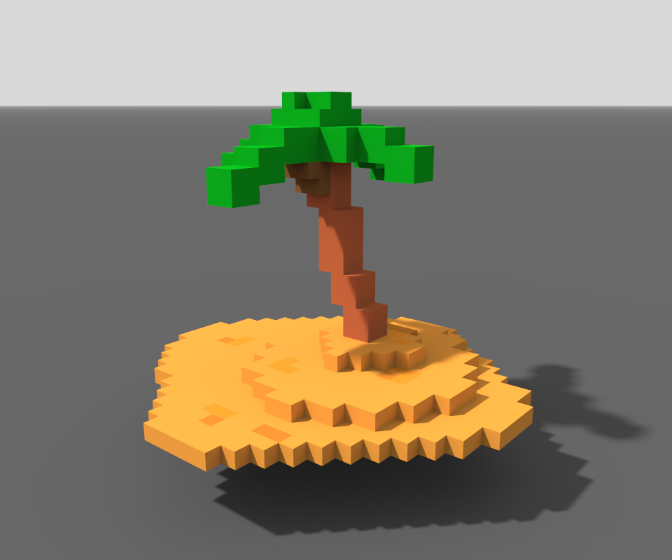
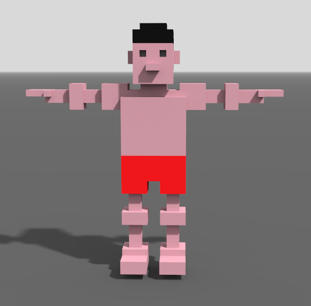
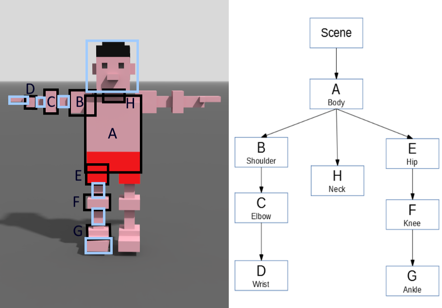

## 26.03.2019
### Idea
Impostato il progetto in locale, abbiamo pensato a cosa fare concretamente. 

L'idea di base è la seguente:
- la scena è un'isola nel mare con un naufrago
- l'animazione consiste nel naufrago che si sbraccia per chiedere aiuto

Bonus (se c'è tempo, in ordine sparso)
- aggiunta di texture sul vestito del naufrago
- un elicottero che recupera il naufrago
- aggiunta del suono per il naufrago che grida aiuto

### Primi schizzi
Con il programma MagicaVoxel ci siamo fatte un'idea della forma che potrebbero avere gli elementi della scena (isola con la palma e naufrago).





Per il naufrago che deve essere animato abbiamo creato un albero che rappresenta le dipendenze tra le varie parti del suo corpo, evidenziando le articolazioni e le parti che, dunque, dovranno essere collegate tra loro per gestire in maniera corretta l'ordine delle rotazioni e delle traslazioni.



## 27.03.2019
Analizziamo la possibilità di strutturare il progetto in classi per gli oggetti della scena (naufrago e isola) per una maggiore leggibilità del codice e una più facile divisione del lavoro.

Fatta una piccola prova del funzionamento delle classi in JavaScript (ES6), decidiamo di intraprendere quella strada.

Riorganizzazione della cartella suddividendo i file con la struttura seguente:

```
cubes-2019-petreska-florio
|
├── css/
|
├── ignores/
|   
├── js/
|   |
|   ├── imports/   
|   |
|   ├── lib/   
|   |
|   └── main.js 
|
├── textures/
|
└── index.html
```

dove il codice del file HTML è stato suddiviso in `index.html`, `css/main.css` e gli script sono stati inseriti in `js/`: in `js/lib` si trovano le librerie esterne, in `js/imports` saranno salvate le classi dove vengono definiti gli oggetti della scena e `main.js` è il file con gli script `Start()` e `Update()`

Decidiamo anche di lavorare su diversi branch, in un primo momento pensiamo di crearne uno per il naufrago e uno per l'isola.


